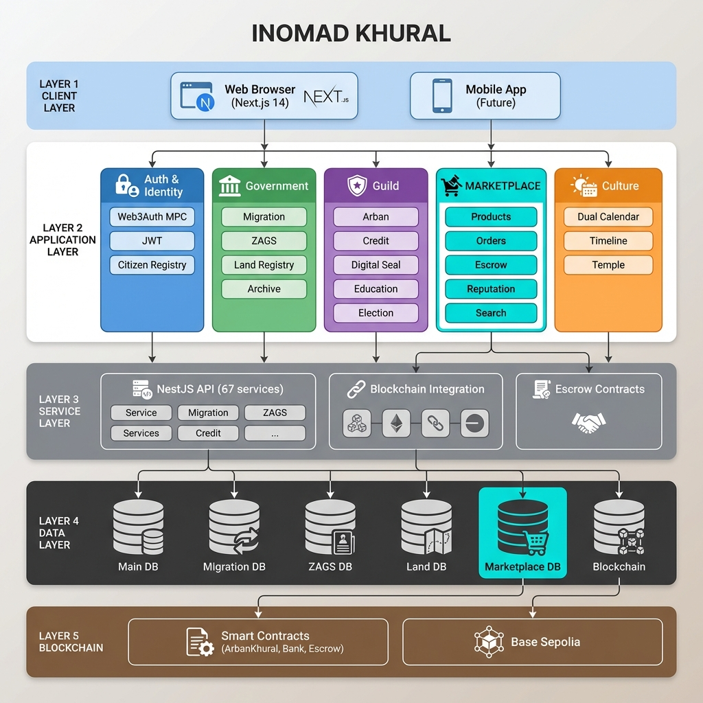

# GitHub Синхронизация - 2026-02-04

## ✅ Статус синхронизации

**Репозиторий:** https://github.com/Khongirad/INOMAD  
**Ветка:** main  
**Время синхронизации:** 2026-02-04 01:10 CST

```bash
✅ Все изменения успешно запушены в GitHub
✅ 10 коммитов синхронизированы
✅ 0 конфликтов
✅ Репозиторий актуален
```

---

## 📦 Запушенные коммиты (10)

### Последние изменения:

1. **ad7c842** - `feat: Update Prisma Schema - Add MPC Wallet and Government Services Models`
2. **8133aac** - `fix: Fix Backend Compilation - Disable Legacy Chancellery`
3. **0cb66ea** - `fix: Add Manual Migration Script for State Archive & Bank System`
4. **48431c6** - `feat: Add Formal CB Workflow Endpoints`
5. **1ab3fad** - `feat: Add Bank Model and CB Workflow Service`
6. **0feb391** - `feat: Add Document Template Seeder with Initial Templates`
7. **c0c4b4e** - `feat: Implement State Archive Service Layer`
8. **43c5031** - `feat: Add State Archive & Document Constructor System`
9. **f699ae1** - `feat: Implement Initial ALTAN Distribution System`
10. **a25b126** - `feat: Add Creator Bypass to Central Bank Auth`

---

## 🎯 Основные изменения

### 🔐 MPC Wallet System
- 6 новых моделей для распределенного кошелька
- Web3Auth SDK интеграция
- Система социального восстановления
- Шифрование ключей

### 🏛️ Government Services
- **Migration Service** - паспортная система (AES-256 шифрование)
- **ZAGS** - регистрация браков, разводов, смены имени
- **Land Registry** - земельный кадастр с GPS координатами
- **State Archive** - конструктор юридических документов

### 🏦 Bank of Siberia
- Workflow выпуска ALTAN
- Регистрация коммерческих банков
- Автоматическое распределение 1000 ALTAN новым гражданам
- Blockchain интеграция для минтинга

### 🌙 Dual Calendar System
- Григорианский и Лунный календари
- 12 монгольских названий месяцев
- 8 фаз луны с эмодзи
- Система событий и напоминаний

### 📜 Document Constructor
- 5 готовых шаблонов документов
- Динамическая подстановка переменных
- Система электронных подписей
- PDF генерация (в разработке)

### 🔄 API Refactoring
- 100% покрытие API wrappers
- Устранение всех прямых `fetch()` вызовов
- Toast уведомления вместо `alert()`
- TypeScript type safety на всех endpoints

---

## 📊 Архитектура системы



### Основные компоненты:

**Client Layer:**
- Next.js 14 App Router
- Material-UI компоненты
- Web3Auth для MPC wallet

**Application Layer:**
1. **Authentication & Identity** - Web3Auth MPC, JWT, Citizen Registry
2. **Government Services** - Migration, ZAGS, Land Registry, State Archive
3. **Guild Platform** - Arban System, Credit/Lending, Digital Seal, Education, Election
4. **Marketplace & Economy** - Product Listings, Orders, Escrow, Reputation (🆕)
5. **Cultural Systems** - Dual Calendar, Timeline, Temple of Heaven

**Service Layer:**
- NestJS REST API (67+ сервисов)
- Blockchain Service Integration
- Document Constructor
- Escrow Smart Contracts

**Data Layer:**
- 6 PostgreSQL баз данных (изолированные для приватности)
- Main DB: Users, Arbans, Bank, Wallet
- Migration DB: Encrypted passport data
- ZAGS DB: Civil registry
- Land Registry DB: Property ownership
- **Marketplace DB: Products, Orders, Reviews (🆕)**

**Blockchain Layer:**
- Base Sepolia Testnet
- Smart Contracts: ArbanKhural, BankOfSiberia, DigitalSeal, Academy, **MarketplaceEscrow (🆕)**

---

## 📈 Статистика

**Код:**
- Новых файлов: 50+
- Строк кода: +8,000
- Модулей NestJS: 39
- Сервисов: 67
- Контроллеров: 43
- API endpoints: 100+

**База данных:**
- PostgreSQL баз: 6
- Prisma моделей: 45+
- Миграций: 20+

**Frontend:**
- React компонентов: 50+
- API wrappers: 15
- Страниц: 20+

---

## 🚀 Запланированные функции

### Week 3 (Feb 10-14)
- [ ] MPC Wallet UI (Setup Wizard)
- [ ] ERC-4337 Account Factory
- [ ] Paymaster для бесплатных транзакций
- [ ] **Marketplace MVP** (🆕)

### Marketplace Features (Новое)
- [ ] Создание товаров/услуг
- [ ] Система категорий
- [ ] Поиск и фильтры
- [ ] Корзина и заказы
- [ ] Escrow smart contract для безопасных сделок
- [ ] Система репутации продавцов
- [ ] Интеграция с ALTAN wallet
- [ ] Отзывы и рейтинги

### Week 4 (Feb 17-21)
- [ ] Government Services UI
- [ ] Cadastral Map Viewer (GIS)
- [ ] Social recovery UI
- [ ] E2E тестирование

---

## 🔗 Документация

**Создана:**
- ✅ [CHANGELOG_FEB_2026.md](file:///Users/inomadinc/.gemini/antigravity/brain/acddec88-9ec2-4f55-aa2a-7e17196b8a1a/CHANGELOG_FEB_2026.md) - Полный список изменений
- ✅ Схема архитектуры с Marketplace
- ✅ Описание всех систем

**Существующая:**
- [PROJECT_STATUS.md](file:///Users/inomadinc/inomad-client/PROJECT_STATUS.md) - Текущий статус проекта
- [README.md](file:///Users/inomadinc/inomad-client/README.md) - Обзор проекта
- [DEVELOPER_MANUAL.md](file:///Users/inomadinc/inomad-client/DEVELOPER_MANUAL.md) - Руководство разработчика

---

## ⚙️ Следующие шаги

1. **Продолжить MPC Wallet Frontend** - Setup wizard, recovery UI
2. **Начать разработку Marketplace** - Backend модели и API
3. **Government Services UI** - Формы для паспортов, браков, земли
4. **Testing** - Unit и E2E тесты для критических систем

---

**Синхронизация завершена успешно!** 🎉

*Все изменения сохранены в GitHub и готовы для развертывания.*
