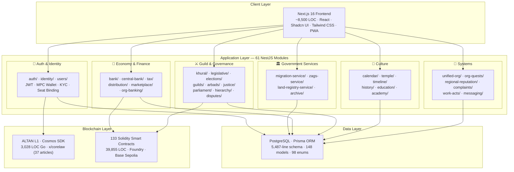
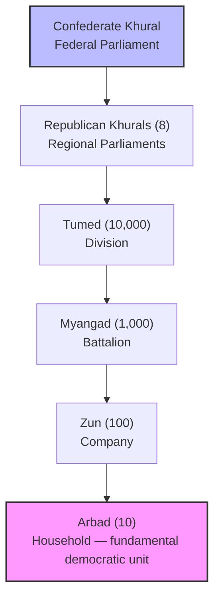
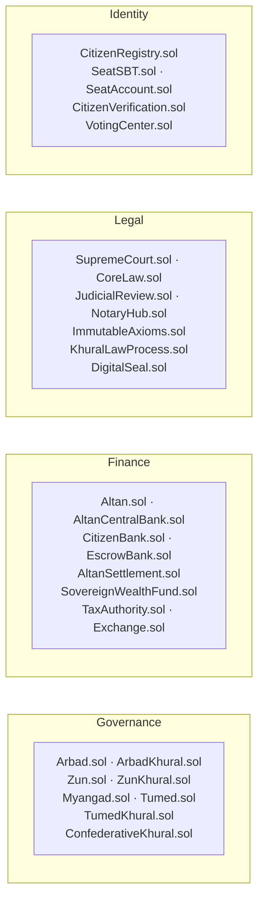

# INOMAD KHURAL — Operating System for Sovereign Governance

## Like Mac for a computer. But for a nation.

[]()
[]()
[]()
[]()
[]()
[]()
[]()

> **Latest Update (Feb 22, 2026):** 95.85% backend test coverage (182 spec files) · 133 smart contracts (39,855 LOC) · Complete Russian→English frontend translation · MUI→Shadcn UI migration · 152+ DB models · 63 NestJS modules · 65 frontend pages · Full blockchain architecture · 5 Government Services · Docker + CI/CD

---

## 🎯 Executive Summary

**INOMAD KHURAL** is an **operating system for sovereign governance** — a complete software stack that runs a digital nation the same way Mac runs a computer. Every function of a modern state — identity, law, economy, parliament, courts, services — is a module in this OS.

Built for the **Siberian Confederation**, a sovereign digital state with constitutional governance, blockchain-enforced law, and a full economic system.

**ALTAN** is the native sovereign currency — technically a stablecoin, legally an independent currency with constitutional mandate.

### Key Numbers (verified from codebase)

| Metric | Value | Location |
|--------|-------|----------|
| **Backend production code** | ~48,900 lines (TypeScript) | `backend/src/` |
| **Frontend production code** | ~8,500 lines (TypeScript/TSX) | `src/` |
| **Test code** | ~26,000 lines (TypeScript) | `*.spec.ts` |
| **Smart contracts** | 133 Solidity contracts, 39,855 LOC | `chain/contracts/` |
| **ALTAN L1 blockchain** | 3,028 lines (Go/Cosmos SDK) | `packages/blockchain-l1/` |
| **x/corelaw module** | 448 lines (constitutional law) | `packages/blockchain-l1/x/corelaw/` |
| **Prisma schema** | 6,364 lines | `backend/prisma/schema.prisma` |
| **Backend modules** | 63 NestJS modules | `backend/src/*/` |
| **Services** | 110 injectable services | `*.service.ts` |
| **Controllers** | 78 REST controllers | `*.controller.ts` |
| **Test suites** | 182 unit + 7 E2E = 189 total | `*.spec.ts` + `test/*.e2e-spec.ts` |
| **Test coverage** | **95.85%+** backend line coverage | Jest |
| **Frontend pages** | 65 routes | `src/app/` |
| **Total codebase** | **~133,000 lines** of source code | — |

---

## 🏗️ Architecture



### Parliamentary Hierarchy (Arbad Model)



---

## 📊 Platform Status — February 18, 2026

### Core Systems — ✅ Operational

| System | Backend Modules | Status | Description |
|--------|----------------|--------|-------------|
| 🔐 **Authentication** | `auth/`, `mpc-wallet/` | ✅ | JWT sessions, Web3Auth MPC wallets, password login |
| 👤 **Identity** | `identity/`, `users/`, `seat-binding/` | ✅ | Citizen registry, KYC, seat binding |
| 🏦 **Banking** | `bank/`, `central-bank/` | ✅ | Dual banking (Central + Citizen), ALTAN currency |
| 🏛️ **Parliament** | `khural/`, `legislative/` | ✅ | Arbad→Zun→Myangad→Tumed, voting center |
| ⚖️ **Justice** | `justice/` | ✅ | Dispute resolution, arbitration |
| 📋 **Elections** | `elections/` | ✅ | On-chain voting, candidate management |
| 🏗️ **Guilds** | `guilds/`, `professions/` | ✅ | Professional guilds, skill certification |
| 📜 **Archive** | `archive/` | ✅ | Document contracts, digital notary |
| 🔏 **Digital Seal** | `digital-seal/` | ✅ | Cryptographic document sealing |
| 💰 **Distribution** | `distribution/` | ✅ | UBI payments, sovereign fund, pension |
| 🎓 **Education** | `education/`, `academy/` | ✅ | Academy of Sciences, educational programs |
| 🏪 **Marketplace** | `marketplace/` | ✅ | Products, orders, escrow, reputation |
| 💸 **Tax** | `tax/` | ✅ | Tax authority, tax calculations |
| 🗺️ **Quests** | `quests/`, `tasks/` | ✅ | Gamified citizen engagement |
| 🌙 **Culture** | `calendar/`, `temple/`, `timeline/` | ✅ | Dual calendar, Temple of Heaven, history |
| 🏢 **Organizations** | `organizations/`, `invitations/` | ✅ | Org management, invitations |
| 🔍 **Transparency** | `transparency/`, `audit/` | ✅ | Public audit logs |
| 🏦 **Org Banking** | `org-banking/` | ✅ | Branch organization finance, smart contracts |
| 🗺️ **Regional Reputation** | `regional-reputation/` | ✅ | Territorial reputation per republic |
| 🏛️ **Parliament** | `parliament/`, `hierarchy/` | ✅ | Full parliamentary hierarchy, unified org |
| ⚔️ **Disputes** | `disputes/`, `complaints/` | ✅ | Hierarchical dispute resolution, complaints |
| 📝 **Work Acts** | `work-acts/` | ✅ | Universal work system, quest-based labor |
| 💬 **Messaging** | `messaging/` | ✅ | Platform messaging system |
| 🛡️ **Inauguration** | `inauguration/` | ✅ | Career logs, Legal trace, Personal Guard |
| 📑 **Legal Contracts**| `legal-contract/` | ✅ | Temple templates, Multi-signature contracts |

### Government Services — ✅ Recently Enabled

| Service | Module | Endpoints | Description |
|---------|--------|-----------|-------------|
| 🛂 **Migration** | `migration-service/` | 9 | Passport applications, document upload, officer review |
| 💒 **ZAGS (Civil Registry)** | `zags-service/` | 13 | Marriage/divorce, dual-consent, certificate verification |
| 🏠 **Land Registry** | `land-registry-service/` | 14 | Cadastral system, GPS search, ownership, leases, transfers |

### Smart Contracts — 133 Solidity Contracts



### Infrastructure — ✅ Production-Ready

| Component | Status | Details |
|-----------|--------|---------|
| 🐳 Docker | ✅ | Multi-stage builds, `docker-compose.yml` (PostgreSQL + Backend + Frontend) |
| 🔄 CI/CD | ✅ | GitHub Actions: lint → build → test → Docker validation |
| 🧪 Tests | ✅ | 176 unit test suites + 7 E2E suites · **95.85% coverage** |
| 🔒 Security | ✅ | Helmet, rate-limiting (100 req/min), global AuthGuard, `@Public()` decorator |
| 📱 PWA | ✅ | Manifest, service worker, offline-first caching |
| 📦 Shared Types | ✅ | `shared/types/` — auth, migration, ZAGS, land registry |

---

## 💡 Key Innovations

### 1. Constitutional Blockchain (ALTAN L1)
- **37 Articles** embedded in genesis state via `x/corelaw` module
- **Article 27**: Network Fee — 0.03% of all transactions → INOMAD INC (capped at 1000 ALTAN)
- **Article 36**: FreezeLaw — Supreme Court emergency powers
- **Immutable**: Constitutional law enforced at protocol level — no legislative override

### 2. Arbad Governance Model
- **10-member households** as fundamental democratic unit
- **Dual structure**: Family Arbads (blood/social) + Organizational Arbads (professional)
- **Direct democracy**: Citizens vote at every hierarchical level
- **Credit system**: Community-backed lending within Arbads

### 3. ALTAN — Sovereign Currency
- **Native currency** of the Siberian Confederation
- **Constitutional mandate**: Article 27 embeds fee structure in protocol
- **Full banking stack**: Central Bank, Citizen Banks, Institutional Banks
- **Distribution**: Weekly UBI (400 ALTAN), Sovereign Fund, Pension System

### 4. MPC Wallet Architecture
- **Non-custodial**: Threshold signatures — users control their keys
- **Recoverable**: Social recovery mechanism — no seed phrases
- **Integrated**: Web2 UX ↔ Web3 ownership bridge

### 5. On-Chain Governance Contracts
- **133 smart contracts** covering full digital nation operations
- **SupremeCourt.sol** + **JudicialReview.sol** — on-chain justice
- **VotingCenter.sol** — all votes recorded on blockchain
- **KhuralLawProcess.sol** — legislative process on-chain

---

## 📦 Repository Structure

```
inomad-client/  (Monorepo — ~137,000 lines)
│
├── src/                          # Next.js 16 frontend (65 pages, 60 components)
│   ├── app/                      # App Router pages
│   ├── components/               # React UI components
│   └── lib/                      # API wrappers, hooks, utilities
│
├── backend/                      # NestJS 10 API server (63 modules)
│   ├── src/                      # 78 controllers, 110 services
│   │   ├── auth/                 # Authentication (JWT, guards, MPC)
│   │   ├── bank/                 # Citizen & institutional banking
│   │   ├── central-bank/         # ALTAN monetary policy
│   │   ├── khural/               # Parliamentary governance
│   │   ├── legislative/          # Voting center, bills
│   │   ├── migration-service/    # Passport office (9 endpoints)
│   │   ├── zags-service/         # Civil registry (13 endpoints)
│   │   ├── land-registry-service/ # Cadastral & property (14 endpoints)
│   │   ├── inauguration/         # Personal Guard & Trace (5 endpoints)
│   │   ├── legal-contract/       # Temple & Multi-sig (9 endpoints)
│   │   ├── marketplace/          # E-commerce, job marketplace
│   │   ├── distribution/         # UBI, pension, sovereign fund
│   │   ├── guilds/               # Professional associations
│   │   ├── elections/            # On-chain voting
│   │   ├── justice/              # Dispute resolution
│   │   ├── archive/              # Document contracts & notary
│   │   ├── digital-seal/         # Cryptographic sealing
│   │   ├── tax/                  # Tax authority
│   │   ├── org-banking/          # Branch organization finance
│   │   ├── parliament/           # Parliament system
│   │   ├── hierarchy/            # Hierarchical governance
│   │   ├── regional-reputation/  # Territorial reputation
│   │   ├── disputes/             # Dispute resolution
│   │   ├── complaints/           # Complaint system
│   │   ├── work-acts/            # Universal work system
│   │   ├── messaging/            # Platform messaging
│   │   └── ... (20 more)         # Education, calendar, temple, etc.
│   ├── prisma/                   # Schema (6,364 lines)
│   └── test/                     # E2E tests (7 suites) + 182 unit spec files
│
├── chain/                        # Smart contracts (Foundry)
│   ├── contracts/                # 133 Solidity contracts (39,855 LOC)
│   ├── script/                   # Deploy scripts
│   └── test/                     # Contract tests
│
├── packages/
│   └── blockchain-l1/            # ALTAN L1 (Cosmos SDK, 2,971 LOC Go)
│       ├── x/corelaw/            # Constitutional law module (37 articles)
│       ├── cmd/altand/           # Node binary
│       └── app/                  # App configuration
│
├── shared/types/                 # Shared TypeScript types
├── docs/                         # Documentation
├── .github/workflows/ci.yml     # CI/CD pipeline
├── docker-compose.yml            # Full stack deployment
└── Dockerfile                    # Production builds
```

---

## 🛠️ Development

### Prerequisites
- Node.js 20+
- PostgreSQL 14+
- Go 1.24+ (for ALTAN L1)
- Foundry (for smart contracts)

### Quick Start

```bash
# Clone repository
git clone https://github.com/Khongirad/INOMAD.git
cd inomad-client

# Frontend
npm install
npm run dev                      # → http://localhost:3000

# Backend
cd backend && npm install
npx prisma generate
npx prisma db push
npm run start:dev                # → http://localhost:3001

# Docker (all services)
docker-compose up -d             # PostgreSQL + Backend + Frontend
```

---

## 🧪 Testing

```bash
# Backend unit tests (176 spec files, 95.85% coverage)
cd backend && npm run test

# Backend E2E tests (7 suites)
cd backend && npm run test:e2e

# Smart contract tests
cd chain && forge test -vvv

# ALTAN L1 tests
cd packages/blockchain-l1 && go test ./x/corelaw/...
```

---

## 🔒 Security

| Feature | Implementation |
|---------|---------------|
| **HTTP Headers** | Helmet (XSS, HSTS, CSP) |
| **Rate Limiting** | 100 requests/minute per IP |
| **Authentication** | Global AuthGuard + `@Public()` decorator |
| **JWT Sessions** | Database-backed with JTI tracking |
| **Passwords** | bcrypt (12 rounds), min 8 chars |

---

## 🔐 Intellectual Property

**Owner**: INOMAD INC  
**Author**: Bair Ivanov (CEO & Founder)  
**Copyright**: © 2026 INOMAD INC. All rights reserved

### Project Timeline
- **2022–2025 (December)**: Research phase — architecture design, constitutional framework, strategic planning
- **December 2025 – Present**: Active codebase development using AI-assisted vibe coding with **Antigravity** (Google DeepMind) and **Claude** (Anthropic), implementing the pre-designed architecture

### Protected Assets
1. **x/corelaw Module** — Constitutional law on Cosmos SDK
2. **37 Constitutional Articles** — Siberian Confederation governance framework
3. **Article 27 Revenue Model** — 0.03% network fee → INOMAD INC
4. **133 Smart Contracts** — Full sovereign governance on-chain
5. **Arbad Governance System** — 10-member household democratic model
6. **61-Module Platform** — Sovereign digital nation infrastructure

### Legal Documentation
See [PROOF_OF_AUTHORSHIP.md](docs/blockchain/PROOF_OF_AUTHORSHIP.md) for:
- Git commit history documenting creation timeline
- File-level authorship evidence
- Constitutional article creation timestamps

---

## 📖 Documentation

### For Investors
- [📊 Project Status](PROJECT_STATUS.md)
- [🏗️ System Architecture](SYSTEM_ARCHITECTURE.md)
- [📝 February 2026 Changelog](CHANGELOG_FEB_2026.md)
- [Revenue Model — Article 27](docs/blockchain/altan_l1_technical_spec.md#article-27-network-fee)

### For Developers
- [Quick Start](docs/getting-started/QUICK_START.md)
- [Developer Manual](docs/getting-started/DEVELOPER_MANUAL.md)
- [Database Setup](docs/getting-started/DATABASE_SETUP.md)
- [Testing Guide](docs/getting-started/INTEGRATION_TESTING_GUIDE.md)

### Architecture
- [Core Invariants](docs/architecture/CORE_INVARIANTS.md)
- [Arbad System](docs/architecture/ARBAD_SYSTEM_GUIDE.md)
- [Enterprise Architecture](docs/architecture/altan_l1_enterprise_architecture.md)
- [Legislative Architecture](docs/architecture/legislative_architecture.md)
- [Wallet/Bank Architecture](docs/architecture/wallet_bank_architecture.md)

### Blockchain
- [ALTAN L1 Technical Spec](docs/blockchain/altan_l1_technical_spec.md)
- [PROOF OF AUTHORSHIP](docs/blockchain/PROOF_OF_AUTHORSHIP.md) ⭐
- [Internal Roadmap](docs/blockchain/altan_l1_internal_roadmap.md)

---

## 🌐 Links

- **GitHub**: [Khongirad/INOMAD](https://github.com/Khongirad/INOMAD)
- **Contact**: [ceo@inomad.life](mailto:ceo@inomad.life)
- **License**: Proprietary — All rights reserved

---

## 📄 License

**Copyright © 2026 INOMAD INC. All rights reserved.**

This software is proprietary. Unauthorized copying, distribution, modification, or use is strictly prohibited without explicit written permission from INOMAD INC.

Article 27 of the Siberian Confederation Constitution establishes INOMAD INC as the beneficiary of network fees (0.03% of all transactions), creating a permanent revenue stream embedded in constitutional law.

---

**Built with ❤️ by INOMAD INC for the Siberian Confederation**  
*Research & architecture: 2022–2025 · Active development: December 2025 – present*  
*AI-assisted vibe coding with Antigravity (Google) & Claude (Anthropic)*
