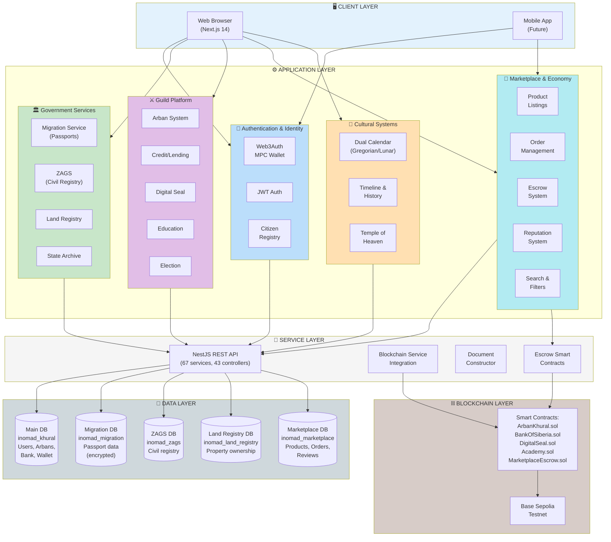

# INOMAD KHURAL - Архитектура системы

**Дата:** 2026-02-04  
**Версия:** 2.0 (с Marketplace)

---

## 📐 Архитектурная диаграмма



---

## 🏗️ Детальное описание компонентов

### 1. 🖥️ Client Layer

**Web Browser (Next.js 14 App Router)**
- Server-side rendering (SSR)
- React Server Components
- Material-UI компоненты
- Responsive design
- PWA capabilities

**Mobile App (Запланировано)**
- React Native
- Native MPC wallet integration
- Offline-first architecture

---

### 2. ⚙️ Application Layer

#### 🔐 Authentication & Identity

**Web3Auth MPC Wallet**
- Multi-Party Computation для распределенных ключей
- Social recovery через guardians
- Device-based encryption
- Biometric support

**JWT Auth**
- Passport.js integration
- Role-based access control (RBAC)
- Token refresh mechanism
- Session management

**Citizen Registry**
- Verification system (5-of-5 Arban matrix)
- Identity documents storage
- Super-verification workflow
- Privacy-preserving checks

---

#### 🏛️ Government Services

**Migration Service (Паспорта)**
- Биометрические данные
- AES-256-GCM шифрование
- Warrant system для правоохранительных органов
- GDPR compliant audit logs
- 14 API endpoints

**ZAGS (Служба записи актов)**
- Регистрация брака с двусторонним согласием
- Divorce processing
- Name changes
- Digital signature support
- Anti-bigamy checks
- 11 API endpoints

**Land Registry (Кадастровая служба)**
- GPS coordinates и GeoJSON границы
- Ownership (только граждане) vs Lease (иностранцы)
- Property transfer workflow
- Mortgage tracking
- Automated valuation
- 14 API endpoints

**State Archive (Государственный архив)**
- Document template system (5 готовых шаблонов)
- Dynamic variable substitution
- Electronic signature workflow
- PDF generation
- Blockchain certificate hashing

---

#### ⚔️ Guild Platform

**Arban System**
- Two-type Arbans (родовой и территориальный)
- 5x5 mutual verification matrix
- Guild formation (10 Arbans)
- Credit scoring based on Arban membership

**Credit/Lending**
- Arban-backed credit lines
- Peer-to-peer lending
- Collateral management
- Automatic repayment

**Digital Seal (2-of-2 Multisig)**
- Khural Representative signature
- Proposer signature
- Smart contract enforcement
- Transaction history

**Education System**
- Course catalog
- Enrollment management
- Progress tracking
- Certificate issuance

**Election System**
- Khural Representative elections
- Voting mechanism
- Candidate management
- Results tabulation

---

#### 🏪 Marketplace & Economy (🆕)

**Product Listings**
- Создание товаров/услуг продавцами
- Категоризация (Товары, Услуги, Недвижимость, etc.)
- Загрузка изображений
- Цены в ALTAN
- Inventory management

**Order Management**
- Shopping cart functionality
- Checkout process
- Order status tracking
- Buyer/seller messaging
- Order history

**Escrow System**
- Smart contract-based escrow
- Funds locked until delivery confirmation
- Dispute resolution mechanism
- Automatic release on confirmation
- Refund handling

**Reputation System**
- Seller ratings (1-5 stars)
- Buyer feedback
- Transaction-based reputation score
- Verified purchase badges
- Review moderation

**Search & Filters**
- Full-text search (PostgreSQL)
- Category filtering
- Price range
- Location-based
- Reputation sorting
- Advanced filters

---

#### 🌙 Cultural Systems

**Dual Calendar System**
- Григорианский календарь (стандартный)
- Лунный календарь (монгольский)
- 12 традиционных названий месяцев
- 8 фаз луны с эмодзи
- Tsagaan Sar (Лунный Новый Год) detection
- Event scheduling для обоих календарей
- Reminder system

**Timeline & History**
- Personal timeline events
- Historical narrative editor
- Markdown support
- Event linking
- Tag system
- Privacy controls

**Temple of Heaven**
- Ritual management
- Cultural celebrations
- Community events
- Sacred space booking

---

### 3. 🔧 Service Layer

**NestJS REST API**
- 39 модулей
- 67 сервисов
- 43 контроллера
- 100+ API endpoints
- OpenAPI documentation (Swagger)
- Request validation (class-validator)
- Error handling middleware

**Blockchain Service Integration**
- Web3.js/Ethers.js для взаимодействия с контрактами
- Transaction building и signing
- Event listening
- Gas estimation
- Nonce management

**Document Constructor**
- Template rendering engine
- Variable interpolation
- Validation rules
- PDF generation (Puppeteer/PDFKit)
- Digital signature integration

**Escrow Smart Contracts (🆕)**
- Marketplace escrow implementation
- Time-locked releases
- Dispute arbitration
- Multi-signature support
- Event emissions для tracking

---

### 4. 💾 Data Layer

**Main Database (inomad_khural)**
- Users (граждане, роли, статусы)
- Arbans (членство, типы)
- Bank (счета, транзакции)
- Wallet (балансы, адреса)
- Guild (10 Arbans)
- MPCWallet (shares, recovery)
- CalendarEvent, CalendarNote
- Timeline, HistoricalRecord

**Migration Database (inomad_migration)**
- PassportApplication
- Document (AES-256 encrypted)
- AccessLog (GDPR audit trail)
- Warrant (law enforcement access)

**ZAGS Database (inomad_zags)**
- Marriage (статус, дата)
- MarriageConsent (цифровые подписи)
- Divorce
- NameChange
- PublicRegistry (verification)

**Land Registry Database (inomad_land_registry)**
- LandPlot (GPS, GeoJSON)
- Property
- Ownership (только граждане)
- Lease (для иностранцев)
- Transaction (transfer history)
- Encumbrance (mortgages, liens)

**Marketplace Database (inomad_marketplace) 🆕**
- Product (название, описание, цена, категория)
- ProductImage
- ProductCategory
- Order (статус, total, buyer, seller)
- OrderItem
- EscrowTransaction (smart contract address, статус)
- Review (rating, comment, verified purchase)
- SellerReputation (aggregated scores)
- SearchIndex (full-text search optimization)

**Технологии:**
- PostgreSQL 16
- Prisma ORM
- Миграции (automated + manual)
- Изолированные БД для приватности
- Connection pooling

---

### 5. ⛓️ Blockchain Layer

**Smart Contracts (Solidity 0.8.x)**

1. **ArbanKhural.sol**
   - Arban membership management
   - Voting mechanisms
   - Guild formation
   - Events для frontend

2. **BankOfSiberia.sol**
   - ALTAN token (ERC-20)
   - Minting/burning
   - Central bank controls
   - Initial distribution (1000 ALTAN)

3. **DigitalSeal.sol**
   - 2-of-2 multisig
   - Khural Representative + Proposer
   - Transaction proposals
   - Execution controls

4. **Academy.sol**
   - Course NFTs
   - Certificate issuance
   - Achievement tracking
   - Reputation integration

5. **MarketplaceEscrow.sol** 🆕
   - Escrow creation для orders
   - Funds locking
   - Delivery confirmation
   - Dispute resolution
   - Automatic refunds
   - Fee collection (platform commission)

**Network: Base Sepolia Testnet**
- L2 Ethereum (low gas fees)
- EVM compatible
- Testnet for development
- Mainnet migration готово

**Планируемые контракты:**
- PassportRegistry.sol (certificate verification)
- MarriageRegistry.sol (public marriage records)
- PropertyRegistry.sol (land NFTs)

---

## 🔄 Data Flow Examples

### Пример 1: Покупка товара на Marketplace 🆕

```
1. Покупатель находит товар → GET /marketplace/products/:id
2. Добавляет в корзину → POST /marketplace/cart/add
3. Оформляет заказ → POST /marketplace/orders/create
4. Backend создает EscrowTransaction → MarketplaceEscrow.sol.createEscrow()
5. Покупатель переводит ALTAN в escrow → BankOfSiberia.sol.transfer()
6. Продавец видит заказ → GET /marketplace/orders/seller
7. Продавец отправляет товар → PUT /marketplace/orders/:id/ship
8. Покупатель подтверждает получение → PUT /marketplace/orders/:id/confirm
9. Smart contract освобождает средства → MarketplaceEscrow.sol.release()
10. Покупатель оставляет отзыв → POST /marketplace/reviews/create
11. Reputation обновляется → SellerReputation auto-recalculated
```

### Пример 2: Регистрация брака (ZAGS)

```
1. Заявитель создает заявку → POST /zags/marriage/apply
2. Оба участника дают согласие → POST /zags/marriage/consent
3. Офицер проверяет eligibility → EligibilityService.checkMarriageEligibility()
4. Офицер регистрирует брак → POST /zags/marriage/register
5. Сертификат генерируется → CertificateService.generateMarriageCertificate()
6. Хеш записывается в blockchain → MarriageRegistry.sol (планируется)
7. Публичная запись создается → PublicRegistry entry
```

### Пример 3: MPC Wallet Recovery

```
1. Пользователь теряет device → Wallet недоступен
2. Инициирует recovery → POST /mpc-wallet/recovery/initiate
3. Guardians получают уведомления → Email/Push notifications
4. 3 из 5 guardians одобряют → POST /mpc-wallet/recovery/approve
5. Новый device share генерируется → RecoveryService.regenerateShare()
6. Пользователь восстанавливает доступ → Wallet unlocked
```

---

## 📊 Технические характеристики

**Backend:**
- Language: TypeScript
- Framework: NestJS 10
- ORM: Prisma 5
- Auth: Passport + JWT
- Validation: class-validator
- API Documentation: Swagger/OpenAPI

**Frontend:**
- Framework: Next.js 14 (App Router)
- UI Library: Material-UI v6
- State Management: React Query + Zustand
- Forms: React Hook Form
- Notifications: Sonner (toast)
- Charts: Recharts

**Blockchain:**
- Solidity: 0.8.20+
- Framework: Hardhat
- Testing: Chai + Ethers
- Network: Base Sepolia
- Wallet: Web3Auth (MPC)

**Database:**
- PostgreSQL: 16
- Миграции: Prisma Migrate
- Backup: pg_dump automated
- Scaling: Connection pooling

**Infrastructure:**
- CI/CD: GitHub Actions
- Hosting: Vercel (frontend), Railway (backend)
- Monitoring: Sentry
- Analytics: PostHog

---

## 🚀 Roadmap

### Week 3 (Feb 10-14)
- [ ] **Marketplace MVP** (backend models, API, UI)
- [ ] MPC Wallet Setup Wizard
- [ ] ERC-4337 Account Factory
- [ ] Government Services UI (forms)

### Week 4 (Feb 17-21)
- [ ] **Marketplace Escrow Smart Contract** deployment
- [ ] Product search optimization
- [ ] Seller dashboard
- [ ] E2E testing

### Future
- [ ] Mobile app (React Native)
- [ ] AI-powered search recommendations
- [ ] Cross-border payments
- [ ] Decentralized storage (IPFS) для product images
- [ ] DAO governance для platform decisions

---

**Создано:** 2026-02-04 01:12 CST  
**Автор:** INOMAD Development Team  
**Версия:** 2.0 (с Marketplace)
