# INOMAD KHURAL — System Architecture

**Date:** February 18, 2026  
**Version:** 3.0 (verified from codebase)

---

## 📐 Architecture Overview

```mermaid
graph TB
    subgraph Client["🖥️ CLIENT LAYER"]
        Web["Web Browser<br/>(Next.js 16.1.1 / Turbopack)"]
        Mobile["Mobile App<br/>(Planned)"]
    end

    subgraph Application["⚙️ APPLICATION LAYER — 61 NestJS Modules"]
        subgraph Auth["🔐 Authentication & Identity"]
            MPC["Web3Auth<br/>MPC Wallet"]
            JWT["JWT Auth<br/>(Global AuthGuard)"]
            Registry["Citizen<br/>Registry"]
        end

        subgraph Govt["🏛️ Government Services"]
            Migration["Migration Service<br/>(Passports)"]
            ZAGS["ZAGS<br/>(Civil Registry)"]
            Land["Land Registry"]
            Archive["State Archive"]
        end

        subgraph Guild["⚔️ Guild & Governance"]
            Arbad["Arbad System"]
            Credit["Credit/Lending"]
            Seal["Digital Seal"]
            Edu["Education"]
            Election["Election"]
            Parliament["Parliament &<br/>Hierarchy"]
        end

        subgraph Economy["🏦 Economy & Finance"]
            Bank["Bank &<br/>Central Bank"]
            Tax["Tax Authority"]
            Distribution["UBI &<br/>Distribution"]
            Marketplace["Marketplace"]
            OrgBanking["Org Banking"]
        end

        subgraph Culture["🌙 Cultural Systems"]
            Calendar["Dual Calendar<br/>(Gregorian/Lunar)"]
            Timeline["Timeline &<br/>History"]
            Temple["Temple of<br/>Heaven"]
        end

        subgraph Systems["🔧 Systems"]
            Messaging["Messaging"]
            Complaints["Complaints &<br/>Disputes"]
            WorkActs["Work Acts"]
            Reputation["Reputation"]
            News["News &<br/>Notifications"]
        end
    end

    subgraph Service["🔧 SERVICE LAYER"]
        API["NestJS REST API<br/>(97 services, 70 controllers)"]
        Blockchain["Blockchain Service<br/>Integration"]
        DocConstructor["Document<br/>Constructor"]
    end

    subgraph Data["💾 DATA LAYER"]
        MainDB[("Unified PostgreSQL DB<br/>inomad_khural<br/>148 models, 98 enums<br/>5,487-line Prisma schema")]
    end

    subgraph Chain["⛓️ BLOCKCHAIN LAYER"]
        Contracts["Smart Contracts:<br/>133 Solidity files (39,855 LOC)<br/>ArbadKhural · BankOfSiberia<br/>DigitalSeal · Academy<br/>MarketplaceEscrow · VotingCenter"]
        L1["ALTAN L1 (Cosmos SDK)<br/>3,028 LOC Go<br/>x/corelaw (37 articles)"]
        Network["Base Sepolia<br/>Testnet"]
    end

    Web --> Auth
    Web --> Govt
    Web --> Guild
    Web --> Economy
    Web --> Culture
    Web --> Systems
    Mobile --> Auth
    Mobile --> Economy

    Auth --> API
    Govt --> API
    Guild --> API
    Economy --> API
    Culture --> API
    Systems --> API

    API --> MainDB
    
    Economy --> Blockchain
    Blockchain --> Contracts
    Contracts --> Network
    Blockchain --> L1

    style Client fill:#e3f2fd
    style Auth fill:#bbdefb
    style Govt fill:#c8e6c9
    style Guild fill:#e1bee7
    style Economy fill:#b2ebf2
    style Culture fill:#ffe0b2
    style Systems fill:#fff3e0
    style Service fill:#f5f5f5
    style Data fill:#cfd8dc
    style Chain fill:#d7ccc8
```



---

## 🏗️ Component Details

### 1. 🖥️ Client Layer

**Web Browser (Next.js 16.1.1 App Router + Turbopack)**
- ~8,500 lines of TypeScript/TSX
- 65 routes (pages)
- 60 reusable React components
- 29 centralized API wrapper modules
- Shadcn/UI + Lucide React icons
- Tailwind CSS
- PWA capabilities
- 100% English (Russian→English translation complete)

**Mobile App (Planned)**
- React Native (future)
- Native MPC wallet integration

---

### 2. ⚙️ Application Layer

#### 🔐 Authentication & Identity

| Module | Description |
|--------|-------------|
| `auth/` | JWT authentication, global AuthGuard, @Public() decorator, session management |
| `identity/` | Citizen registry, KYC, verification chain (5-of-5 Arbad matrix) |
| `users/` | User CRUD, profile management |
| `seat-binding/` | SeatSBT identity binding |
| `mpc-wallet/` | Web3Auth MPC wallet, social recovery |
| `wallet-protection/` | Wallet security, key share management |
| `verification/` | Verification workflows, super-verification |
| `citizenship/` | Citizenship status management |
| `onboarding/` | Guided onboarding quest "Путь Гражданина" |

---

#### 🏛️ Government Services

| Module | Endpoints | Description |
|--------|-----------|-------------|
| `migration-service/` | 9 | Passport applications, document upload, AES-256-GCM encryption, warrants, GDPR audit logs |
| `zags-service/` | 13 | Marriage registration with dual-consent, divorce, name changes, 18+ age validation, anti-bigamy |
| `land-registry-service/` | 14 | GPS/GeoJSON parcels, ownership (citizens) / lease (foreigners), transfers, encumbrances |
| `archive/` | — | Document templates, variable substitution, electronic signatures, blockchain certificate hashing |

---

#### ⚔️ Guild & Governance

| Module | Description |
|--------|-------------|
| `arbads/` | Two-type Arbads (family + organizational), 5x5 verification matrix |
| `guilds/` | Professional guilds, skill certification |
| `professions/` | Profession registry |
| `khural/` | Parliamentary governance, motions, voting |
| `legislative/` | Voting center, bills, law process |
| `elections/` | On-chain voting, candidate management |
| `parliament/` | Khural sessions (Tumed leaders) |
| `hierarchy/` | Zun→Myangad→Tumed hierarchy |
| `justice/` | Dispute resolution, arbitration |
| `digital-seal/` | 2-of-2 multisig sealing |

---

#### 🏦 Economy & Finance

| Module | Description |
|--------|-------------|
| `bank/` | Citizen & institutional banking |
| `central-bank/` | ALTAN monetary policy, minting/burning |
| `tax/` | Tax authority, calculations |
| `distribution/` | UBI (400 ALTAN/week), sovereign fund, pension |
| `marketplace/` | Products, orders, escrow, shopping cart, full-text search, seller reputation |
| `org-banking/` | Organization finance, dual authorization, daily reports |

---

#### 🌙 Cultural Systems

| Module | Description |
|--------|-------------|
| `calendar/` | Dual calendar (Gregorian + Lunar Mongolian), 12 traditional months, 8 moon phases, Tsagaan Sar detection |
| `timeline/` | Personal timeline events, historical narrative editor |
| `history/` | Historical records |
| `temple/` | Temple of Heaven — rituals, cultural celebrations, sacred space booking |
| `education/` | Course catalog, enrollment, progress, certificates |
| `academy/` | Academy of Sciences |

---

#### 🔧 System Modules

| Module | Description |
|--------|-------------|
| `messaging/` | DM, group, org, case-thread messaging |
| `complaints/` | Hierarchical complaint escalation |
| `disputes/` | Pre-complaint negotiation (contracts/quests/work-acts) |
| `work-acts/` | Universal work-act completion system |
| `notifications/` | In-app notification system |
| `news/` | News publishing system |
| `reputation/` | Universal reputation & trust |
| `regional-reputation/` | Territorial reputation per republic |
| `quest/` | Quest/task assignment |
| `quests/` | Quest board |
| `org-quests/` | Organization task board |
| `organizations/` | Organization management |
| `unified-org/` | Unified organization system |
| `invitations/` | Invitation system |
| `gamification/` | Citizen XP, levels, achievements |
| `census/` | Demographic aggregation |
| `chancellery/` | Contract registry for lawyers/notaries |
| `transparency/` | Public audit logs (GOST) |
| `admin/` | Admin & creator management |

---

### 3. 🔧 Service Layer

**NestJS REST API**
- 61 modules
- 97 services
- 70 controllers
- 130+ API endpoints
- OpenAPI/Swagger documentation (70/70 controllers tagged)
- Request validation (class-validator)
- Error handling middleware
- Global AuthGuard (`JwtAuthGuard` as APP_GUARD)
- Rate limiting (ThrottlerGuard: 100 req/min)

---

### 4. 💾 Data Layer

**Unified PostgreSQL Database (`inomad_khural`)**
- Single Prisma schema: 5,487 lines
- 148 models
- 98 enums
- PostgreSQL 16
- Prisma ORM with automated migrations
- Connection pooling

> **Note**: All data (users, government services, marketplace, etc.) is stored in a single unified database. The Prisma schema manages all 148 models within one database instance.

---

### 5. ⛓️ Blockchain Layer

**Smart Contracts (Solidity 0.8.x)**
- 133 contracts, 39,855 total lines
- Framework: Hardhat
- Network: Base Sepolia Testnet

| Contract Category | Key Contracts |
|-------------------|--------------|
| Governance | ArbadKhural.sol, Arbad.sol, Zun.sol, ZunKhural.sol, Myangad.sol, Tumed.sol, TumedKhural.sol, ConfederativeKhural.sol |
| Finance | Altan.sol, AltanCentralBank.sol, CitizenBank.sol, EscrowBank.sol, AltanSettlement.sol, SovereignWealthFund.sol, TaxAuthority.sol |
| Legal | SupremeCourt.sol, CoreLaw.sol, JudicialReview.sol, NotaryHub.sol, ImmutableAxioms.sol, KhuralLawProcess.sol, DigitalSeal.sol |
| Identity | CitizenRegistry.sol, SeatSBT.sol, SeatAccount.sol, CitizenVerification.sol, VotingCenter.sol |
| Marketplace | RetailMarketplace.sol, ServiceMarketplace.sol, AuctionHouse.sol, CommodityExchange.sol, JobMarketplace.sol, AltanPaymentGateway.sol |
| Infrastructure | DigitalProductPassport.sol, UnifiedChancellery.sol, StockExchange.sol, ForexExchange.sol |

**ALTAN L1 (Cosmos SDK)**
- 3,028 lines of Go code
- `x/corelaw` module with 37 constitutional articles
- Article 27: Network Fee — 0.03% → INOMAD INC

---

## 📊 Technical Specifications

**Backend:**
- Language: TypeScript
- Framework: NestJS 10
- ORM: Prisma 5
- Auth: Global JwtAuthGuard + @Public() decorator
- Validation: class-validator
- API Documentation: Swagger/OpenAPI (70/70 controllers)
- Rate Limiting: ThrottlerGuard (100 req/min)

**Frontend:**
- Framework: Next.js 16.1.1 (App Router + Turbopack)
- React: 19.2.3
- UI Library: Shadcn/UI + Lucide React
- Styling: Tailwind CSS
- Forms: React Hook Form
- Notifications: Sonner (toast)

**Blockchain:**
- Solidity: 0.8.20+
- Framework: Hardhat
- Network: Base Sepolia
- Wallet: Web3Auth (MPC)

**Database:**
- PostgreSQL 16
- Prisma ORM (single unified schema)
- Automated migrations

**Infrastructure:**
- CI/CD: GitHub Actions (backend build+test, frontend build, Docker validation)
- Docker: Multi-stage builds with docker-compose.yml
- Security: Helmet, rate-limiting, global AuthGuard

---

## 🧪 Testing

| Type | Count | Details |
|------|-------|---------|
| Unit test spec files | 176 | ~25,900 lines of test code |
| E2E test suites | 7 | health, auth, migration, ZAGS, land, citizen-lifecycle, marketplace |
| Backend coverage | **95.85%** | Line coverage (Jest) |
| CI pipeline | ✅ | Unit tests only (E2E not in CI) |

---

## 🔐 Security

| Feature | Implementation |
|---------|---------------|
| Authentication | Global JwtAuthGuard as APP_GUARD |
| Public endpoints | @Public() decorator (9 endpoints) |
| Rate limiting | ThrottlerGuard: 100 req/min per IP |
| HTTP headers | Helmet (XSS, HSTS, CSP) |
| Passwords | bcrypt (12 rounds), min 8 chars |
| JWT sessions | Database-backed with JTI tracking |

---

## 🔄 Data Flow Examples

### Example 1: Marketplace Purchase

```
1. Buyer searches products        → GET /marketplace/products?search=...
2. Adds to cart                  → POST /marketplace/cart/add
3. Creates order                 → POST /marketplace/orders/create
4. Backend creates EscrowTx      → EscrowTransaction record
5. Buyer transfers ALTAN         → On-chain transfer to escrow
6. Seller sees order             → GET /marketplace/orders/seller
7. Seller ships                  → PUT /marketplace/orders/:id/ship
8. Buyer confirms receipt        → PUT /marketplace/orders/:id/confirm
9. Escrow releases funds         → Smart contract release
10. Buyer leaves review          → POST /marketplace/reviews/create
11. Seller reputation updated    → Auto-recalculated
```

### Example 2: Marriage Registration (ZAGS)

```
1. Applicant submits             → POST /zags/marriage/apply
2. Both parties consent          → POST /zags/marriage/consent
3. Officer checks eligibility    → EligibilityService (18+ age validation, anti-bigamy)
4. Officer registers marriage    → POST /zags/marriage/register
5. Certificate generated         → CertificateService
6. Public registry updated       → PublicRegistry entry
```

### Example 3: Citizen Lifecycle

```
1. User registers                → POST /auth/register
2. Verification chain            → 5 verifiers approve identity
3. MPC wallet created            → Web3Auth key shares
4. Seat binding                  → SeatSBT minted
5. Arbad membership              → Joins 10-member household
6. Banking activated             → ALTAN wallet created
7. UBI distribution              → Weekly 400 ALTAN payment
```

---

## 📁 Repository Structure

```
inomad-client/  (Monorepo — ~132,000 lines)
│
├── src/                          # Next.js 16 frontend (65 pages, 60 components)
│   ├── app/                      # App Router pages
│   ├── components/               # React UI components (Shadcn/UI)
│   └── lib/                      # API wrappers (29), hooks, utilities
│
├── backend/                      # NestJS 10 API server (61 modules)
│   ├── src/                      # 70 controllers, 97 services
│   │   ├── auth/                 # Authentication (JWT, global AuthGuard)
│   │   ├── bank/                 # Citizen & institutional banking
│   │   ├── central-bank/         # ALTAN monetary policy
│   │   ├── marketplace/          # E-commerce with escrow
│   │   ├── migration-service/    # Passport office (9 endpoints)
│   │   ├── zags-service/         # Civil registry (13 endpoints)
│   │   ├── land-registry-service/ # Cadastral system (14 endpoints)
│   │   └── ... (54 more)         # All 61 modules
│   ├── prisma/                   # Schema (5,487 lines, 148 models, 98 enums)
│   └── test/                     # 7 E2E test suites + 176 unit spec files
│
├── chain/                        # Smart contracts
│   └── contracts/                # 133 Solidity contracts (39,855 LOC)
│
├── packages/
│   └── blockchain-l1/            # ALTAN L1 (Cosmos SDK, 3,028 LOC Go)
│       └── x/corelaw/            # Constitutional law module (37 articles)
│
├── shared/types/                 # Shared TypeScript types (5 files)
├── docs/                         # Documentation
├── .github/workflows/ci.yml     # CI/CD pipeline
├── docker-compose.yml            # Full stack deployment
└── Dockerfile                    # Production builds
```

---

**Created:** February 4, 2026  
**Last Updated:** February 18, 2026  
**Version:** 3.0 (verified from codebase audit)
