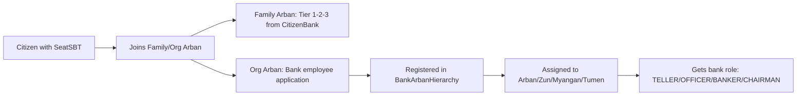

# BankArbanHierarchy ↔ ArbanCompletion Integration Plan

## Overview

**Two separate but connected systems:**

1. **ArbanCompletion** — Citizen organization (Family/Organizational Arbans)
2. **BankArbanHierarchy** — Bank internal structure (Tumen → Myangan → Zun → Arban)

## Key Principle

> **Every bank employee is a citizen FIRST, bank employee SECOND.**

```
Citizen (SeatSBT) → ArbanCompletion membership → Bank employment → BankArbanHierarchy position
```

---

## Current State

### ArbanCompletion
- **Family Arbans**: Legislative (Khural) power - MANDATORY for all citizens
- **Organizational Arbans**: Executive/Judicial/Banking branches, Organizations, Guilds
- **Arban size**: 10 citizens per Arban
- **Scaling**: Arban (10) → Zun (10 Arbans = 100) → Myangan (10 Zuns = 1000) → Tumen (10 Myangans = 10000)

### BankArbanHierarchy
- **Internal bank structure**: Builds **bottom-up**
  - Start: Create Arban (10 employees)
  - Growth: 10 Arbans → Zun (100)
  - Growth: 10 Zuns → Myangan (1000)
  - Growth: 10 Myangans → Tumen (10000)
- **Role assignment by position**: CHAIRMAN, BANKER, OFFICER, TELLER
- **Collective responsibility**: Performance scores cascade upwards
- **Employee tracking**: Links `seatId` to position in hierarchy

---

## Integration Architecture

### 1. Citizen → Bank Employee Flow



### 2. Data Flow

| System | Stores | Links |
|--------|--------|-------|
| **ArbanCompletion** | Citizen Arban membership | `seatId` → `arbanId` |
| **CitizenBank** | Personal accounts, tier distribution | `seatId` → `accountId` |
| **BankArbanHierarchy** | Employment structure | `seatId` → `employeeId` → `arbanId` |

### 3. Dual Mandatory Membership

**Every citizen has exactly TWO Arbans:**

1. **Family Arban** (MANDATORY)
   - Legislative power (Khural)
   - Formed through marriage
   - Provides Tier 1-2-3 distribution from CitizenBank
   - One Khural representative per family (husband OR wife)

2. **ONE of the following** (MANDATORY):
   - **Executive Branch** Organizational Arban (Government, Presidency)
   - **Judicial Branch** Organizational Arban (Courts)
   - **Banking Branch** Organizational Arban (Central Bank, Commercial Banks)
   - **Organization** Arban (Private/State companies)
   - **Professional Guild** Arban
     - Guild elects representative
     - Representative nominated to Temple of Heaven:
       - Scientific Council (for scholars/scientists)
       - Wisdom Council (for wise citizens)

**Example:**
```
Citizen Ivan Petrov:
├─ Family Arban #234 (with wife + children)
└─ Bank Employee Arban #5 (BankArbanHierarchy, position: Teller)
```

---

## Implementation Steps

### Phase 1: Link ArbanCompletion → BankArbanHierarchy

**Goal**: Bank hiring requires ArbanCompletion membership.

#### Smart Contract Updates

**BankArbanHierarchy.sol** — Add validation:

```solidity
// Add reference to ArbanCompletion
ArbanCompletion public arbanCompletion;

function setArbanCompletion(address _arban) external onlyRole(DEFAULT_ADMIN_ROLE) {
    arbanCompletion = ArbanCompletion(_arban);
}

// Update registerEmployee to check ArbanCompletion
function registerEmployee(
    uint256 arbanId,
    address wallet,
    uint256 seatId
) external onlyRole(OFFICER_ROLE) returns (uint256 employeeId) {
    // VALIDATION: Must be a citizen with seat
    require(seatId != 0, "Must have SeatSBT");
    
    // OPTIONAL: Check if in Org Arban
    (ArbanCompletion.ArbanType arbanType, uint256 citizenArbanId) = 
        arbanCompletion.getArbanTypeForSeat(seatId);
    
    // Register as bank employee
    // ... existing logic
}
```

### Phase 2: Backend Integration

#### New Service: `bank-hierarchy.service.ts`

```typescript
@Injectable()
export class BankHierarchyService {
  constructor(
    private readonly blockchainService: BlockchainService,
  ) {}

  async registerEmployee(employeeData: {
    seatId: number;
    wallet: string;
    arbanId: number; // Bank Arban (10-person unit)
  }) {
    // 1. Verify citizen exists in ArbanCompletion
    const arbanType = await this.verifyArbanMembership(employeeData.seatId);
    
    // 2. Register in BankArbanHierarchy
    const tx = await this.hierarchyContract.registerEmployee(
      employeeData.arbanId,
      employeeData.wallet,
      employeeData.seatId
    );
    
    // 3. Store in DB
    await this.prisma.bankEmployee.create({
      data: {
        seatId: employeeData.seatId,
        wallet: employeeData.wallet,
        bankArbanId: employeeData.arbanId,
        employeeId: result.employeeId,
      }
    });
  }

  private async verifyArbanMembership(seatId: number) {
    const result = await this.arbanCompletionContract.getArbanTypeForSeat(seatId);
    
    if (result.arbanType === 0) { // NONE
      throw new Error('Employee must be member of an Arban');
    }
    
    return result;
  }
}
```

#### Database Schema Addition

```prisma
model BankEmployee {
  id            Int      @id @default(autoincrement())
  seatId        Int      @unique
  wallet        String
  employeeId    Int      @unique // On-chain employee ID
  bankArbanId   Int      // Arban (10) this employee belongs to
  performance   Int      @default(75)
  isActive      Boolean  @default(true)
  createdAt     DateTime @default(now())
  updatedAt     DateTime @updatedAt
}
```

### Phase 3: Role Assignment Logic

**Automatic role assignment based on position:**

```typescript
function getRole(hierarchyPosition: {
  tumenId: number;
  myanganId: number;
  zunId: number;
  arbanId: number;
  isArbanLeader: boolean;
  isZunLeader: boolean;
  isMyanganLeader: boolean;
  isTumenLeader: boolean;
}): BankRole {
  if (hierarchyPosition.isTumenLeader) return 'CHAIRMAN_ROLE';
  if (hierarchyPosition.isMyanganLeader) return 'BANKER_ROLE';
  if (hierarchyPosition.isZunLeader) return 'OFFICER_ROLE';
  if (hierarchyPosition.isArbanLeader) return 'TELLER_ROLE';
  return 'EMPLOYEE'; // Regular employee
}
```

---

## API Endpoints

### POST `/bank/hierarchy/register-employee`

```json
{
  "seatId": 123,
  "wallet": "0x...",
  "bankArbanId": 5
}
```

### GET `/bank/hierarchy/employee/:seatId`

```json
{
  "seatId": 123,
  "employeeId": 45,
  "hierarchy": {
    "arban": { "id": 5, "name": "Retail Unit 5" },
    "zun": { "id": 2, "name": "Retail Division" },
    "myangan": { "id": 1, "name": "Branch 1" },
    "tumen": { "id": 1, "name": "Altan Bank of Siberia" }
  },
  "role": "TELLER_ROLE",
  "performance": 85,
  "citizenArban": {
    "type": "FAMILY",
    "arbanId": 234
  }
}
```

---

## Benefits

1. **Citizen-First**: Bank employees are citizens with full rights
2. **Tier Distribution**: Employees receive Tier 1-2-3 from CitizenBank
3. **Khural Representation**: Employees can be Khural representatives via Family Arban
4. **Performance Tracking**: Bank hierarchy tracks work performance separately
5. **Collective Responsibility**: Performance cascades up hierarchy

---

## Next Steps

1. ✅ BankArbanHierarchy.sol (complete)
2. ✅ Unit tests (complete)
3. 🔄 Add ArbanCompletion reference to BankArbanHierarchy
4. 🔄 Create `BankHierarchyService` backend
5. 🔄 Add Prisma schema for BankEmployee
6. 🔄 Add API endpoints
7. 🔄 Deploy and test integration

**Status**: Ready for backend implementation.
