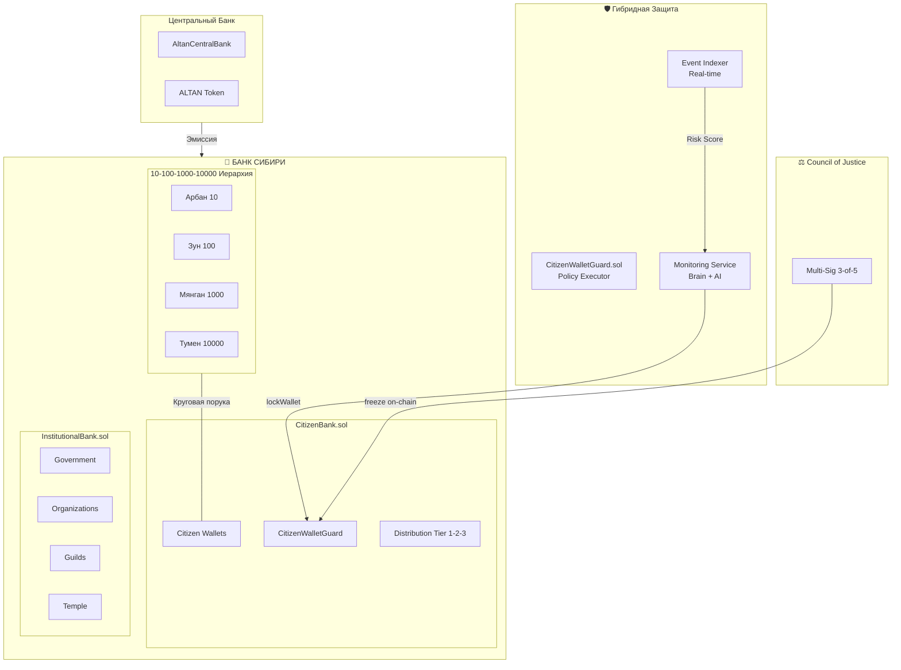

# Архитектура Altan Wallet & Банк Сибири v2.0

**Дата**: 2026-01-31 | **Статус**: APPROVED

---

## 🏛️ Утверждённая Архитектура



---

## ✅ Принятые Решения

| Вопрос | Решение | Обоснование |
|--------|---------|-------------|
| CitizenWalletGuard | **Гибрид** | Contract = замок, Backend = камера |
| Event Listener | **Indexer** | Real-time мониторинг + Risk Scoring |
| Council of Justice | **On-chain Multi-Sig** | Прозрачность, невозможность подделки |
| Split контракта | **Да** | Изоляция рисков CitizenBank ↔ InstitutionalBank |
| Разблокировка | **1-of-N** | Один верификатор разблокирует кошелёк |

---

## 📐 10-100-1000-10000 Административная Иерархия

> **Круговая порука**: Ответственность одного = общая ответственность каждого

```
ТУМЕН (10,000)
└── МЯНГАН (1,000) x10
    └── ЗУН (100) x10
        └── АРБАН (10) x10
            └── Сотрудник Банка
```

**Применение к Банку Сибири:**

| Уровень | Роль | Права |
|---------|------|-------|
| Арбан (10) | TELLER_ROLE | Базовые операции |
| Зун (100) | OFFICER_ROLE | Открытие счетов, Tier 1 |
| Мянган (1000) | BANKER_ROLE | Одобрение Tier 2-3 |
| Тумен (10000) | CHAIRMAN_ROLE | Freeze, конфигурация |

---

## 🏗️ Структура Контрактов

### 1. CitizenBank.sol (Розничный)

```solidity
contract CitizenBank is AccessControl {
    // 1-of-N unlock
    function unlockWallet(uint256 seatId) external onlyVerifier;
    
    // Distribution
    function distributeTier1(uint256 seatId) external;
    function requestTier2_3(uint256 seatId, uint8 tier) external;
    function approveTier(uint256 requestId) external onlyBanker;
    
    // Daily limits
    uint256 public dailyLimit = 100_000e6;
    uint256 public singleTxLimit = 50_000e6;
}
```

### 2. InstitutionalBank.sol 

```solidity
contract InstitutionalBank is AccessControl {
    // Government accounts
    function openGovAccount(address treasury) external onlyChairman;
    
    // Organization accounts  
    function openOrgAccount(uint256 orgId) external onlyOfficer;
    
    // Guild accounts
    function openGuildAccount(uint256 guildId) external onlyOfficer;
    
    // Temple accounts
    function openTempleAccount() external onlyChairman;
}
```

### 3. CitizenWalletGuard.sol (Policy Executor)

```solidity
contract CitizenWalletGuard {
    mapping(address => bool) public isLocked;
    mapping(address => uint256) public riskScore;
    
    // Backend can lock based on risk
    function lockWallet(address wallet, string reason) external onlyMonitor;
    
    // Multi-sig judicial freeze
    function judicialFreeze(address wallet, bytes32 caseHash) external onlyJustice;
    
    // Pre-tx check (called by wallet)
    function checkTransaction(address from, address to, uint256 amount) 
        external view returns (bool allowed);
}
```

### 4. JudicialMultiSig.sol

```solidity
contract JudicialMultiSig {
    uint256 public constant THRESHOLD = 3; // 3-of-5 judges
    
    function proposeFreezeOrder(address wallet, bytes32 caseHash) external onlyJudge;
    function signOrder(uint256 orderId) external onlyJudge;
    function executeOrder(uint256 orderId) external; // Anyone after threshold
}
```

---

## 🔍 Event Indexer Architecture

```mermaid
graph LR
    subgraph BLOCKCHAIN
        EVENTS[Transfer, Approval<br/>Freeze, Unlock]
    end
    
    subgraph INDEXER["Indexer Service"]
        LISTENER[Event Listener]
        PARSER[Event Parser]
        SCORER[Risk Scorer]
        DB[(PostgreSQL)]
    end
    
    subgraph BACKEND["Protection Service"]
        API[REST API]
        ALERT[Alert System]
        TRIGGER[Contract Trigger]
    end
    
    EVENTS --> LISTENER
    LISTENER --> PARSER
    PARSER --> SCORER
    SCORER --> DB
    SCORER -->|High Risk| ALERT
    ALERT --> TRIGGER
    TRIGGER -->|lockWallet()| BLOCKCHAIN
```

**Risk Patterns:**

| Pattern | Score | Action |
|---------|-------|--------|
| Normal tx | 0-20 | ✅ Allow |
| Large transfer | 30-50 | ⚠️ Monitor |
| All funds out | 70-90 | 🔴 Alert + Review |
| Blacklisted address | 100 | 🚫 Auto-lock |

---

## 📋 Файлы для Создания

### Smart Contracts

| Файл | Действие | Приоритет |
|------|----------|-----------|
| `CitizenBank.sol` | Создать | P0 |
| `InstitutionalBank.sol` | Создать | P0 |
| `CitizenWalletGuard.sol` | Создать | P0 |
| `JudicialMultiSig.sol` | Создать | P1 |
| `BankArbadHierarchy.sol` | Создать | P1 |

### Backend Services

| Файл | Действие | Приоритет |
|------|----------|-----------|
| `event-indexer/` | Создать | P0 |
| `wallet-protection.service.ts` | Создать | P0 |
| `risk-scorer.service.ts` | Создать | P1 |
| `alert.service.ts` | Создать | P1 |

---

## 🚀 План Реализации

### Phase 1: Разделение Банка (3 дня)

- [ ] Экстракт логики граждан → `CitizenBank.sol`
- [ ] Экстракт институционального → `InstitutionalBank.sol`
- [ ] Обновить `AltanWalletRegistry` → 1-of-N unlock
- [ ] Миграция тестов

### Phase 2: Защита (4 дня)

- [ ] `CitizenWalletGuard.sol` — policy executor
- [ ] `JudicialMultiSig.sol` — судебные ордера
- [ ] Event Indexer service
- [ ] `WalletProtectionService` backend

### Phase 3: Иерархия (2 дня)

- [ ] `BankArbadHierarchy.sol` — 10-100-1000-10000
- [ ] Role mapping через Арбаны
- [ ] Круговая порука механизм
